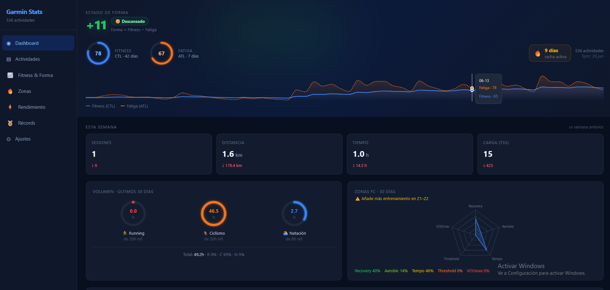

# Training Dashboard



Panel personal para ver tus estadísticas de entrenamiento de Strava: actividades, mapas, zonas de FC, fitness (CTL/ATL/TSB), récords y más.

Los datos se descargan de tu cuenta de Strava a archivos locales en tu ordenador. La app los lee desde ahí; no hay servidor en la nube ni base de datos.

> **Nota:** la API de Strava ahora exige una suscripción de pago, así que este proyecto no la usa. En su lugar, lee el **export de datos** que Strava te da gratis a cualquier cuenta (ver paso 2). Eso significa que la sincronización no es instantánea: pides el export, esperas a que Strava te lo prepare, y lo procesas con el script.

---

## Qué necesitas antes de empezar

Instala estas dos cosas si no las tienes ya:


| Programa                      | Para qué sirve            | Cómo comprobarlo                             |
| ----------------------------- | ------------------------- | -------------------------------------------- |
| **Node.js** (v18 o superior)  | Ejecutar la app web       | Abre una terminal y escribe `node --version` |
| **Python** (v3.10 o superior) | Procesar tu export de Strava | Escribe `python3 --version`                  |


También necesitas una **cuenta de Strava** con tus actividades subidas (por ejemplo, desde tu reloj Garmin o tu ciclocomputador).

> **¿No tienes Node.js o Python?**
>
> - Node.js: [https://nodejs.org](https://nodejs.org) → descarga la versión LTS.
> - Python: [https://python.org/downloads](https://python.org/downloads) → en Mac/Linux suele venir instalado.

---

## Guía paso a paso

### 1. Descargar el proyecto

Si ya tienes la carpeta `training-dashboard` en tu ordenador, ábrela en la terminal:

```bash
cd ruta/donde/está/training-dashboard
```

(Sustituye `ruta/donde/está/training-dashboard` por la ruta real, por ejemplo `/Users/tu-usuario/Documents/training-dashboard`.)

---

### 2. Pedir tu export de datos de Strava

No hace falta ninguna API key ni contraseña: Strava te deja descargar un archivo con todo tu historial de forma gratuita, para cualquier cuenta.

1. En la web de Strava (no en la app móvil): **Settings/Configuración → My Account/Mi cuenta → "Download or Delete Your Account" / "Descargar o eliminar tu cuenta"**. Ahí verás un botón **"Request Your Archive" / "Solicitar tu archivo"** — no vas a borrar nada, es la misma pantalla pero ese botón es solo para exportar. Más detalle en la [ayuda oficial de Strava](https://support.strava.com/hc/en-us/articles/216918437-Exporting-your-Data-and-Bulk-Export).
2. Pulsa **"Request Your Archive"**. Strava te enviará un correo con un enlace de descarga — normalmente en pocas horas, puede tardar más si tienes muchísimo historial.
3. Descarga el `.zip` (algo como `export_12345678.zip`) a tu ordenador. **No lo descomprimas dentro de la carpeta del proyecto** (o, si lo haces, asegúrate de que quede fuera de lo que subes a git — ver la sección de Privacidad).
4. (Opcional, para no escribir la ruta cada vez) Copia el archivo de ejemplo y apunta a tu export:
  ```bash
   cp .env.example .env
  ```
  ```
   STRAVA_EXPORT_PATH=/ruta/donde/guardaste/export_12345678.zip
  ```
   Si no rellenas esto, simplemente pasa la ruta con `--export` cada vez que ejecutes el script (ver paso 4).

> El export es una "foto" completa de tu cuenta en el momento de pedirlo, no algo incremental. Cuando quieras actualizar los datos con entrenamientos nuevos, vuelve a pedir un export y procésalo de nuevo — el script no repite trabajo con las actividades que ya tenga guardadas.

---

### 3. Instalar dependencias de Python (sincronización)

Entra en la carpeta `fetch` e instala las librerías necesarias:

```bash
cd fetch
python3 -m pip install -r requirements.txt
cd ..
```

> Si `pip` no funciona, prueba con `python3 -m pip install -r requirements.txt` desde la carpeta `fetch`.

---

### 4. Procesar tu export de Strava

Desde la carpeta raíz del proyecto (`training-dashboard`), una vez tengas el `.zip` descargado (paso 2):

```bash
python3 fetch/sync.py --export /ruta/a/export_12345678.zip --limit 20
```

(Si rellenaste `STRAVA_EXPORT_PATH` en `.env`, puedes omitir `--export`.)

**Qué hace este comando:**

- Lee `activities.csv` y los archivos `.fit`/`.gpx` de tu export (sin descomprimirlo a disco)
- Convierte cada actividad al mismo formato que usaba la app antes
- Guarda todo en `public/data/` (archivos JSON)

Con muchos años de historial, la primera pasada puede tardar varios minutos (está parseando un archivo por actividad). Pruébalo primero con `--limit 20` para comprobar que todo funciona antes de procesar el export completo.

**Opciones útiles:**

```bash
# Solo las 20 actividades más recientes (para probar)
python3 fetch/sync.py --export export_12345678.zip --limit 20

# Solo actividades desde una fecha
python3 fetch/sync.py --export export_12345678.zip --since 2024-01-01

# Más rápido, sin extraer las rutas GPS
python3 fetch/sync.py --export export_12345678.zip --no-gpx
```

> **Importante:** el export de Strava es una foto completa de tu cuenta, no algo incremental. Para actualizar con entrenamientos nuevos, vuelve a pedir un export (paso 2) y procésalo de nuevo apuntando `--export` al `.zip` nuevo — las actividades que ya tengas en `public/data/` no se vuelven a parsear.

---

### 5. Instalar dependencias de la app web

En la carpeta raíz del proyecto:

```bash
npm install
```

Solo hace falta hacerlo **una vez** (o cuando cambien las dependencias del proyecto).

---

### 6. Abrir la app

```bash
npm run dev
```

Verás algo como:

```
  ➜  Local:   http://localhost:5173/
```

Abre ese enlace en el navegador (Chrome, Firefox, Safari…).

Para **cerrar** la app, vuelve a la terminal y pulsa `Ctrl + C`.

---

## Resumen rápido (cuando ya lo hayas hecho una vez)

Cada vez que quieras usar la app con datos actualizados:

```bash
# 1. Pide un export nuevo desde la web de Strava (paso 2) y descárgalo

# 2. Procesarlo
python3 fetch/sync.py --export /ruta/al/export_nuevo.zip

# 3. Arrancar la app
npm run dev
```

Luego abre [http://localhost:5173](http://localhost:5173) en el navegador.

---

## Ajustes dentro de la app

En el menú lateral, entra en **Ajustes** para configurar:

- FC máxima
- FTP (ciclismo)
- FC y ritmo en umbral (running)

Estos valores se guardan en tu navegador y afectan a los cálculos de zonas, TSS y fitness.

---

## Problemas frecuentes

### "ERROR: Pass --export <path-to-export.zip> or set STRAVA_EXPORT_PATH in .env"

No pasaste `--export` ni rellenaste `STRAVA_EXPORT_PATH` en `.env`. Repite el **paso 2** (o el final del paso 2, rellenar `.env`).

### "ERROR: Could not read the export..." o "activities.csv not found"

- Comprueba que la ruta apunta al `.zip` que te descargaste (o a la carpeta si ya lo descomprimiste), no a otra cosa.
- Si descomprimiste el zip a mano, asegúrate de apuntar a la carpeta que contiene `activities.csv` (a veces queda dentro de una subcarpeta).

### Algunas actividades salen con menos datos de los esperados (sin potencia, sin FC...)

Normal si esa actividad no tiene un archivo asociado en el export (p. ej. una entrada manual sin dispositivo) o si el archivo es `.tcx` (de momento solo se parsean `.fit` y `.gpx` en detalle). La actividad sigue apareciendo, pero con los campos que falten en blanco.

### "No se encontró /data/activities.json" en la app

Aún no has procesado ningún export. Ejecuta primero:

```bash
python3 fetch/sync.py --export /ruta/a/tu/export.zip
```

### La terminal dice que `node` o `npm` no existen

Instala Node.js desde [nodejs.org](https://nodejs.org) y vuelve a abrir la terminal.

### El procesado va lento

Normal si tienes muchos años de historial: el script abre y parsea un archivo `.fit`/`.gpx` por actividad. Prueba con `--limit 20` o `--no-gpx` para una pasada rápida; el resto puedes dejarlo corriendo en segundo plano.

### Puerto 5173 ya en uso

Cierra otras ventanas de terminal donde tengas `npm run dev` corriendo, o Vite te propondrá otro puerto (por ejemplo 5174).

---

## Comandos extra (opcional)


| Comando           | Descripción                                                |
| ----------------- | ---------------------------------------------------------- |
| `npm run build`   | Genera una versión optimizada en la carpeta `dist/`        |
| `npm run preview` | Previsualiza la versión de producción (después de `build`) |
| `npm run lint`    | Revisa el código con el linter                             |


---

## Estructura del proyecto (referencia)

```
training-dashboard/
├── .env                 ← Ruta a tu export (opcional, no compartir)
├── fetch/
│   ├── sync.py          ← Script que procesa tu export de Strava
│   ├── normalizer.py    ← Mapea el CSV/FIT al formato que lee la app
│   ├── fit_reader.py    ← Parseo de archivos .fit / .gpx
│   └── requirements.txt ← Dependencias de Python
├── public/data/         ← Datos descargados (JSON)
└── src/                 ← Código de la app web (React)
```

---

## Privacidad y qué NO subir a GitHub

Estos archivos contienen datos personales o credenciales. El `.gitignore` ya los excluye, pero conviene conocerlos:

| Archivo / carpeta | Qué contiene | Riesgo |
|-------------------|--------------|--------|
| `export_*.zip` / carpeta descomprimida | TODO tu historial de Strava en bruto (GPX/FIT/TCX + CSV) | Ubicación exacta, salud, hábitos — más sensible que cualquier otro archivo del proyecto |
| `.env` | Solo la ruta local a tu export (opcional) | Bajo, pero no aporta nada compartirlo |
| `public/data/` | Actividades, estadísticas y rutas GPS ya procesadas | Ubicación exacta, salud, hábitos |
| `dist/data/` | Copia de los datos al hacer `npm run build` | Igual que arriba |

**Datos sensibles dentro de los JSON:**
- Coordenadas GPS de cada entrenamiento (pueden revelar dónde vives o entrenas)
- Ciudades en los títulos de actividades
- FC, VO2max, calorías, ritmos y patrones horarios

**Seguro para publicar:**
- `.env.example` (solo tiene placeholders)
- Todo el código en `src/` y `fetch/`

**Antes de hacer `git push`**, comprueba que no se cuelen datos:

```bash
git status
```

No deberían aparecer `.env`, el `.zip` del export, ni archivos dentro de `public/data/`. Si alguna vez los añadiste por error:

```bash
git rm -r --cached public/data/
git rm --cached .env
git rm --cached export_*.zip   # si llegaste a añadir el export
```

Luego haz commit de la eliminación. Si ya subiste tu export o `public/data/` a GitHub, considera borrar el historial del repositorio — esos archivos no tienen "revocar acceso" posible como una API key, así que la única forma de invalidarlos es no dejarlos en el historial.

